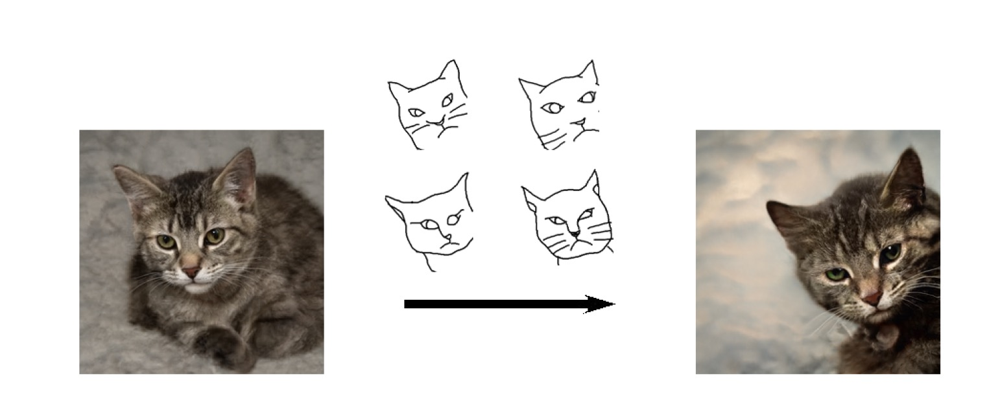

## Sketch Your Own GAN（Jittor）

The GANSketching model takes one or a few sketches as input, and outputs a customized model by modifiying weights on the basis of a pretrained StyleGAN. The output GAN network can generate pictures with shape and pose that match the input sketches while preserving other characters including texture and background.


Also, we did some extra experiments on photo editing. In addition to implementing the ganspace PCA analysis proposed by the original work, we explored another editing method called SEFA. With photo editing, we can change specific characters of the generating process, for example, we can tilt a cat's head or  paint a black horse white.

## Run Our Project

### Clone our repo

```bash
git clone git@github.com:maxminder/gansketching_reproducing.git
cd gansketching_reproducing
```

### Install packages

- Install Jittor (Refer to：https://cg.cs.tsinghua.edu.cn/jittor/download/)

- Install other dependencies:

  ```bash
  pip install -r requirements.txt
  ```

### Download model weights

Before the customization process, we first need to obtain the pre-tained StyleGan model weights:

- Run `bash weights/download_weights.sh`


### Generate samples from a customized model

To generate samples from the StyleGAN model both before or after the customized process , we can run `generate.py` with specified model weigths by specifying the  `ckpt`  argument. The sample pictures will be saved to `save_dir`.

```bash
# generates samples from the "standing cat" model.
python generate.py --ckpt weights/photosketch_standing_cat_noaug.pth --save_dir output/samples_standing_cat
```

Other optional arguments are as follows:

- *size*：output size of the generator
- *fixed_z*：a .pth file. If given, will use this file as the input noise for the output
- *w_shift*: a .pth file. Apply a w-latent shift to the generator
- *batch_size*: batch size used to generate outputs
- *samples*: number of samples to generate, will be overridden if --fixed_z is given
- *truncation*：strength of truncation
- *truncation_mean*：number of samples to calculate the mean latent for truncation
- *seed*：if specified, use a fixed random seed
- *device*：default as cuda.

**Careful :** In order to support loading weights from output `ckpt` saved by `jittor.save()` , we change the load method from `jittor.load()` to the followings:

```python
import pickle
with open(args.ckpt, 'rb') as f:
  obj = f.read()
weights = {
  key: weight_dict for key, weight_diict in pickle.loads(obj, encoding = 'latin1').items()
}

netG.load_state_dict(weights)
```

However, this method can't load regular `ckpt` files. Therefore, **if you want to generate samples using the directly downloaded model weights**, you need to manually change it back to `jittor.load()`.

### Latent space edits by GANSpace

Our model preserves the latent space editability of the original model. Our models can apply the same edits using the latents reported in Härkönen et.al. ([GANSpace](https://github.com/harskish/ganspace)) by running `ganspace.py`

```bash
# add fur to the standing cats
python ganspace.py --obj cat --comp_id 27 --scalar 50 --layers 2,4 --ckpt weights/photosketch_standing_cat_noaug.pth --save_dir output/ganspace_fur_standing_cat
```

Special arguments are defined as follows:

- *obj*： choices=['cat', 'horse', 'church'],  which StyleGAN2 class to use
- ***comp_id***：which principle component to use
- ***scalar***: strength applied to the latent shift, value can be negative
- ***layers***: layers to apply GANSpace (e.g., 3,5 means layer 3 to 5）

### Latent space edits by Sefa

By running  `editor.py`, you can add a specific shift in latent space and edit the photo.

```bash
# make the cat fat
python editor.py --obj cat --eigen_id 4 --scalar 15 --layers 1,3 --slice 3 --ckpt weights/photosketch_standing_cat_noaug.pth --save_dir output/sefa_standing_cat
```

Special arguments are defined as follows:

- *obj*： choices=['cat', 'horse', 'church'],  which StyleGAN2 class to use
- ***eigen_id***：which eigenvector to use
- ***scalar***:  absolute value of the max strength applied to the latent shift
- ***layers***: layers to apply GANSpace (e.g., 1,4 means layer 1 to 4）
- ***slice***: strength applied to the latent shift increases by the value of ***slice*** each step.


## Model Training

Training and evaluating on model trained on PhotoSketch inputs requires running [the Precision and Recall metric](https://github.com/kynkaat/improved-precision-and-recall-metric). The following command pulls the submodule of the forked Precision and Recall [repo](https://github.com/PeterWang512/precision_recall).

```bash
git submodule update --init --recursive
```

### Download Datasets and Pre-trained Models

The following scripts downloads our sketch data, our evaluation set, [LSUN](https://dl.yf.io/lsun), and pre-trained models from [StyleGAN2](https://github.com/NVlabs/stylegan2) and [PhotoSketch](https://github.com/mtli/PhotoSketch).

```bash
# Download the sketches
bash data/download_sketch_data.sh

# Download evaluation set
bash data/download_eval_data.sh

# Download pretrained models from StyleGAN2 and PhotoSketch
bash pretrained/download_pretrained_models.sh

# Download LSUN cat, horse, and church dataset
bash data/download_lsun.sh
```

To train FFHQ models with image regularization, please download the [FFHQ dataset](https://github.com/NVlabs/ffhq-dataset) using this [link](https://drive.google.com/file/d/1WvlAIvuochQn_L_f9p3OdFdTiSLlnnhv/view?usp=sharing). This is the zip file of 70,000 images at 1024x1024 resolution. Unzip the files, , rename the `images1024x1024` folder to `ffhq` and place it in `./data/image/`.


### Training Scripts

The example training configurations are specified using the scripts in `scripts` folder. Use the following commands to launch trainings.

```bash
# Train the "horse riders" model
bash scripts/train_photosketch_horse_riders.sh

# Train the "standing cat" model
bash scripts/train_standing_cat.sh

# Train the cat face model in Figure. 1 of the paper.
bash scripts/train_teaser_cat.sh

# Train on a single quickdraw sketch
bash scripts/train_quickdraw_single_horse0.sh

# Train on sketches of faces (1024px)
bash scripts/train_authorsketch_ffhq0.sh
```

The training progress is tracked using `wandb` by default. To disable wandb logging, please add the `--no_wandb` tag to the training script.

If you want to train the model with configurations different from our existing settings, you can directly run `train.py` and change the input arguments. We list some of the most used arg rules below, view options.py if you need other settings.

- `--optim_param_g  w_shift`：Make a shift in W-space the only tunable parameter of the generator
- `--dsketch_no_pretrain`：Initialize D-scratch randomly
- `--diffaug_policy translation`：Apply data augmentation
- `--l_image xxx`：Set the strength of image regularization loss to xxx
- `--l_weight yyy`：Set the strength of weight regularization loss to yyy

We also provide several **complete scripts** that covers all the processes from training、generating、and evaluating, you can run the scripts using the following commands:

```bash
# Train, generate, evaluate all in one
# Dataset: horse rider;
# Other configs: with aug, image & weight regularization strength set to 0.7
bash scripts/train_photosketch_horse_riders_weight_image.sh
```

### Evaluations

Make sure to download the evaluation set before applying evaluation.

```bash
bash data/download_eval_data.sh
```

After training, follow the "**Generate samples from a customized model**" and generate samples from customized models weights. Then use the following command to evaluate the FID scores between the *evaluation set* (under the <eval_pics_dir>) and the *generated pictures* (under the <output_pics_dir>), the FID scores will be printed on screen.

```bash
# python3 -m pytorch_fid <output_pics_dir> <eval_pics_dir> --device cuda
python3 -m pytorch_fid output/horse_riders_augment data/eval/horse_riders/image --device cuda
```

### About Transplanting Pytorch Projects To Jittor

Due to the differences between Pytorch and Jittor, we met many problems when transplanting the project. We list some of our problems below in hope of providing reference for people with similar problems.

- **Variance**

  Jittor doesn't provide a function for calculating variance of data  `var(x)`. Also, transforming `Jittor.var` to  `numpy.array`  may break the gradient. Therefore, we implement out own variance calculation in <*line 680-685*> in `stylegan2.py`.

- **ConvTranspose2D (group>1)**

  ConvTranspose2D function in Jittor only support convolution with argument  `group = 1`.  We provide a simple implementation in <*line 229-241*> in `stylegan2.py`.

- **Dataloader**

  Jittor doesn't have a `Dataloader` function, but its `Dataset` class can substitute for the `Dataloader` function in Pytorch. But they have different grammar details, so check the official documents to adapt Pytorch codes to Jittor frame.

- **save_img**

  When generating pictures, our pictures saved using  `jittor.save_img()` were extremely dark at first. We discovered that  `save_img() `  function was implemented differently from Pytorch, therefore we need to pay close attention to image saving process when transplanting Pytorch codes. Direct use of `PIL`  of   `Image` is proved to be effective, and thus strongly recommended.

- **Cuda Op**

  Like Pytorch, Jittor also provides its own way of applying customized cuda operators. We refer to Jittor's original codes and these docs below:

  - https://cg.cs.tsinghua.edu.cn/jittor/tutorial/2020-3-17-09-51-custom_op/

  - https://cg.cs.tsinghua.edu.cn/jittor/tutorial/2020-5-2-16-45-customop/

## Related Works

* Sheng-Yu Wang, David Bau, Jun-Yan Zhu. ["Sketch Your Own GAN"](https://arxiv.org/abs/2108.02774). In ArXiv.
* R. Gal, O. Patashnik, H. Maron, A. Bermano, G. Chechik, D. Cohen-Or. ["StyleGAN-NADA: CLIP-Guided Domain Adaptation of Image Generators."](https://arxiv.org/abs/2108.00946). In ArXiv. (concurrent work)
* D. Bau, S. Liu, T. Wang, J.-Y. Zhu, A. Torralba. ["Rewriting a Deep Generative Model"](https://arxiv.org/abs/2007.15646). In ECCV 2020.
* Y. Wang, A. Gonzalez-Garcia, D. Berga, L. Herranz, F. S. Khan, J. van de Weijer. ["MineGAN: effective knowledge transfer from GANs to target domains with few images"](https://arxiv.org/abs/1912.05270). In CVPR 2020.
* M. Eitz, J. Hays, M. Alexa. ["How Do Humans Sketch Objects?"](http://cybertron.cg.tu-berlin.de/eitz/pdf/2012_siggraph_classifysketch.pdf). In SIGGRAPH 2012.
* Erik H¨ark¨onen, Aaron Hertzmann, Jaakko Lehtinen, and Sylvain Paris. ["Ganspace: Discovering interpretable gan controls"](https://arxiv.org/abs/2004.02546). In Advances in Neural Information Processing Systems, 2020.7, 8, 14
* Yujun Shen, Bolei Zhou. ["Closed-Form Factorization of Latent Semantics in GANs"](https://arxiv.org/abs/2007.06600). The IEEE Conference on Computer Vision and Pattern Recognition (CVPR), 2020.7
